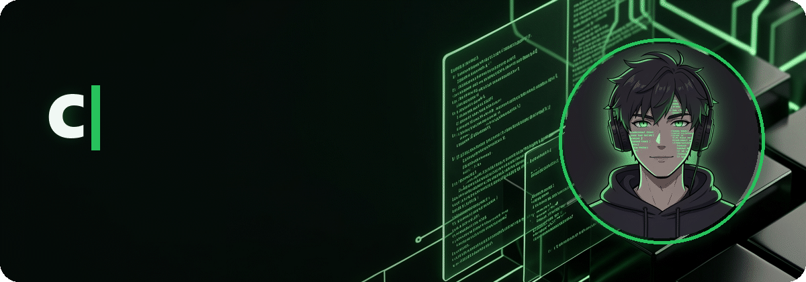
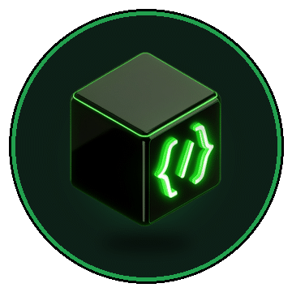

<div align="center">



<a href="https://github.com/CatLon-dev">
  
</a>

[](https://github.com/CatLon-dev)
[](https://github.com/CatLon-dev?tab=repositories)
[](https://github.com/CatLon-dev)

</div>

<br>

<table>
<tr>
<td width="62%" valign="top">

### 👋 Sobre mí

```js
const catlon = {
  rol:        "Full Stack Developer",
  estudio:    "Ingeniería de Software con Inteligencia Artificial",
  construyo:  ["Webs", "Landing pages", "Sistemas a medida", "E-commerce"],
  enfoque:    "Proyectos reales, rápidos y fáciles de mantener",
  aprendiendo:"IA aplicada a negocios",
};
```

- 🌱 Estudiante de **Ingeniería de Software con IA**
- 💻 Desarrollo **Web**, **Backend** y **IA aplicada**
- 🚀 Construyendo proyectos reales y escalables
- 🤝 Abierto a colaborar en proyectos interesantes

</td>
<td width="38%" align="center" valign="middle">



</td>
</tr>
</table>

<div align="center">

## 🧠 Skills

</div>

<div align="center">

| 🎨 Frontend | ⚙️ Backend y bases de datos | 🧰 Lenguajes y herramientas |
| :---: | :---: | :---: |
|  |  |  |

### 🖥️ Sistemas operativos


</div>

<br>

<div align="center">

## 📊 Estadísticas


</div>

<br>

<div align="center">

## 🐍 La serpiente se come mis contribuciones

<picture>
  <source media="(prefers-color-scheme: dark)" srcset="https://raw.githubusercontent.com/CatLon-dev/CatLon-dev/output/github-contribution-grid-snake-dark.svg" />
  
</picture>

</div>

<br>

<div align="center">

### 💬 ¡Gracias por pasar por mi perfil!

Si algún repositorio te sirve o te gusta, déjale una ⭐ — y si tienes una idea interesante, **siempre estoy abierto a colaborar**.


</div>
